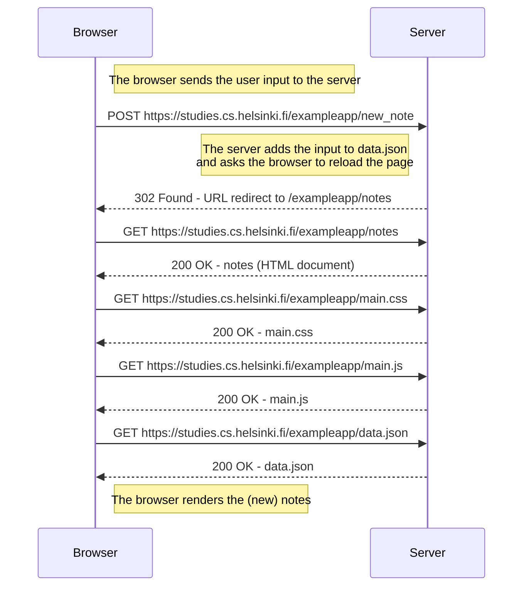

```mermaid
sequenceDiagram

Note right of Browser: The browser sends the user input to the server

Browser->>Server: POST https://studies.cs.helsinki.fi/exampleapp/new_note

Note left of Server: The server adds the input to data.json<br>and asks the browser to reload the page

Server-->>Browser: 302 Found - URL redirect to /exampleapp/notes

Browser->>Server: GET https://studies.cs.helsinki.fi/exampleapp/notes
Server-->>Browser: 200 OK - notes (HTML document)

Browser->>Server: GET https://studies.cs.helsinki.fi/exampleapp/main.css
Server-->>Browser: 200 OK - main.css

Browser->>Server: GET https://studies.cs.helsinki.fi/exampleapp/main.js
Server-->>Browser: 200 OK - main.js

Browser->>Server: GET https://studies.cs.helsinki.fi/exampleapp/data.json
Server-->>Browser: 200 OK - data.json

Note right of Browser: The browser renders the (new) notes
```
