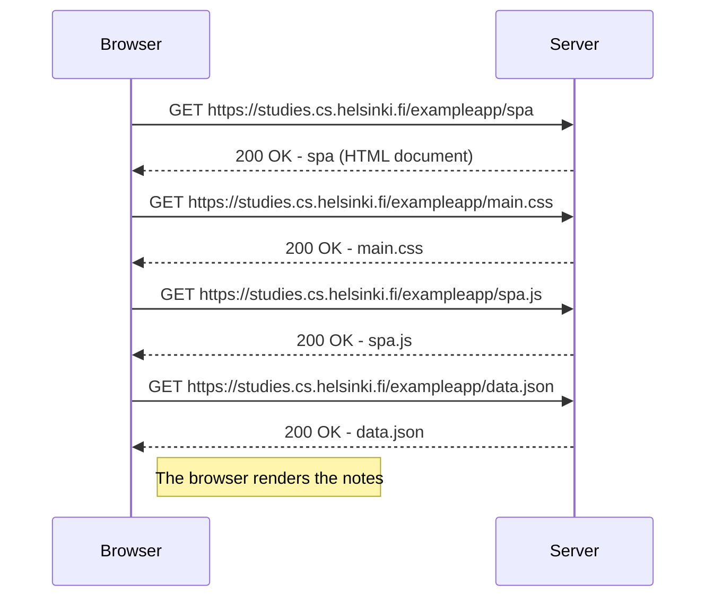

```mermaid
sequenceDiagram

Browser->>Server: GET https://studies.cs.helsinki.fi/exampleapp/spa

Server-->>Browser: 200 OK - spa (HTML document)

Browser->>Server: GET https://studies.cs.helsinki.fi/exampleapp/main.css
Server-->>Browser: 200 OK - main.css

Browser->>Server: GET https://studies.cs.helsinki.fi/exampleapp/spa.js
Server-->>Browser: 200 OK - spa.js

Browser->>Server: GET https://studies.cs.helsinki.fi/exampleapp/data.json
Server-->>Browser: 200 OK - data.json

Note right of Browser: The browser renders the notes
```
