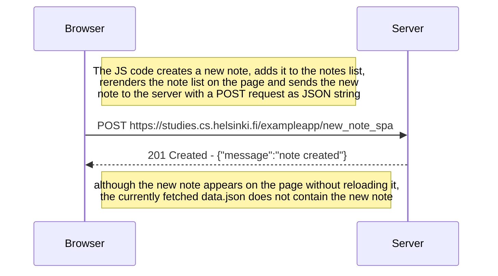

```mermaid
sequenceDiagram

Note right of Browser: The JS code creates a new note, adds it to the notes list,<br>rerenders the note list on the page and sends the new<br>note to the server with a POST request as JSON string

Browser->>Server: POST https://studies.cs.helsinki.fi/exampleapp/new_note_spa

Server-->>Browser: 201 Created - {"message":"note created"}

Note right of Browser: although the new note appears on the page without reloading it,<br> the currently fetched data.json does not contain the new note
```
